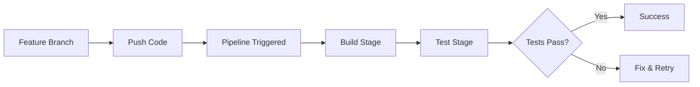
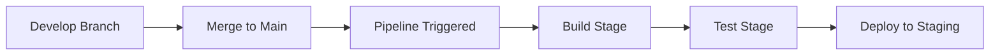
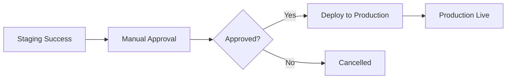

# מדריך הגדרת Pipeline ב-Azure DevOps

## תוכן עניינים
1. [סקירה כללית](#סקירה-כללית)
2. [דרישות מוקדמות](#דרישות-מוקדמות)
3. [הגדרת Pipeline](#הגדרת-pipeline)
4. [רכיבי Pipeline](#רכיבי-pipeline)
5. [זרימת עבודה](#זרימת-עבודה)
6. [הגדרות סביבה](#הגדרות-סביבה)
7. [משתנים וסודות](#משתנים-וסודות)
8. [פתרון בעיות](#פתרון-בעיות)

## סקירה כללית

ה-Pipeline של StudyHub-IL מיושם ב-Azure DevOps ומכיל את כל החוקים, המשימות והסביבות שמרכיבים את מחזור החיים של האפליקציה – מהקוד ועד הפריסה.

### זרימת העבודה של Pipeline

```
Code Commit → Trigger Pipeline → Build Stage → Test Stage → Publish Artifact → Deploy to Environment
```

## דרישות מוקדמות

לפני שמתחילים, יש לוודא שיש לכם:

1. **חשבון Azure DevOps**
   - גישה לארגון ב-Azure DevOps
   - הרשאות ליצירת Pipeline

2. **Azure Subscription**
   - חשבון Azure פעיל
   - הרשאות ליצירת משאבים (App Services, Static Web Apps)

3. **Service Connection**
   - חיבור בין Azure DevOps ל-Azure Subscription

4. **מאגר קוד (Repository)**
   - מאגר GitHub או Azure Repos עם הקוד של StudyHub-IL

## הגדרת Pipeline

### שיטה 1: שימוש בקובץ YAML (מומלץ)

קובץ `azure-pipelines.yml` כבר קיים במאגר הקוד. להלן השלבים להגדרה:

1. **יצירת Pipeline חדש**:
   - היכנסו ל-Azure DevOps
   - נווטו אל Pipelines → Create Pipeline
   - בחרו את מקור הקוד שלכם (GitHub/Azure Repos)
   - בחרו "Existing Azure Pipelines YAML file"
   - בחרו את הקובץ `/azure-pipelines.yml`

2. **הגדרת Service Connection**:
   - נווטו אל Project Settings → Service connections
   - צרו connection חדש לסוג "Azure Resource Manager"
   - תנו לו את השם `Azure-Subscription-Connection`

3. **הגדרת Environments**:
   - נווטו אל Pipelines → Environments
   - צרו שלוש סביבות:
     - `Development` - סביבת פיתוח
     - `Staging` - סביבת Staging
     - `Production` - סביבת ייצור
   - עבור `Production`, הגדירו Approvals ידניים

### שיטה 2: ממשק גרפי (Classic Editor)

אם אתם מעדיפים ממשק גרפי:

1. נווטו אל Pipelines → New Pipeline
2. בחרו "Use the classic editor"
3. בחרו את מקור הקוד
4. בחרו תבנית "Empty job"
5. הוסיפו את השלבים והמשימות באופן ידני לפי המבנה ב-YAML

## רכיבי Pipeline

### 1. מקור הקוד (Repository Connection)

```yaml
trigger:
  branches:
    include:
      - main
      - develop
      - feature/*
```

- **חיבור למאגר**: Pipeline מתחבר אוטומטית למאגר GitHub/Azure Repos
- **טריגרים**: Pipeline רץ אוטומטית בכל commit ל-branches מסוימים

### 2. טריגרים (Triggers)

#### Continuous Integration (CI) Triggers
- **Push לענפים**: main, develop, feature/*
- **Pull Requests**: אל main ו-develop
- **הגבלות נתיבים**: לא רץ על שינויים בקבצי README או documentation

#### Schedule Triggers (אופציונלי)
ניתן להוסיף הרצה מתוזמנת:

```yaml
schedules:
- cron: "0 0 * * *"
  displayName: Daily midnight build
  branches:
    include:
    - main
```

### 3. סוכנים (Agents / Runners)

```yaml
pool:
  vmImage: 'ubuntu-latest'
```

- **Hosted Agents**: שימוש ב-agents מנוהלים של Azure (`ubuntu-latest`)
- **Self-hosted Agents**: ניתן להחליף ל-agents עצמאיים אם נדרש

### 4. שלבים (Stages)

#### Stage 1: Build - בנייה
- **BuildBackend**: בניית קוד Backend
  - התקנת Node.js
  - התקנת תלויות (npm ci)
  - יצירת Prisma Client
  - הרצת Linter
  - העתקת קבצים ל-Artifact

- **BuildFrontend**: בניית קוד Frontend
  - התקנת Node.js
  - התקנת תלויות
  - בניית אפליקציה (npm run build)
  - העתקת dist ל-Artifact

#### Stage 2: Test - בדיקות
- **TestBackend**: בדיקות Backend
  - הרצת PostgreSQL כ-service
  - הרצת בדיקות עם Jest
  - פרסום תוצאות בדיקות
  - פרסום כיסוי קוד

#### Stage 3-5: Deploy - פריסה
- **DeployDevelopment**: פריסה לסביבת פיתוח (develop branch)
- **DeployStaging**: פריסה ל-Staging (main branch)
- **DeployProduction**: פריסה לייצור (אחרי Staging + אישור ידני)

### 5. משימות (Tasks / Jobs / Steps)

כל שלב מכיל משימות ספציפיות:

| משימה | תיאור | דוגמה |
|-------|-------|-------|
| `NodeTool@0` | התקנת Node.js | הגדרת גרסה 18.x |
| `Cache@2` | שמירת תלויות במטמון | חיסכון בזמן build |
| `script` | הרצת פקודות Shell | npm ci, npm build |
| `CopyFiles@2` | העתקת קבצים | העתקה ל-Artifact |
| `PublishBuildArtifacts@1` | פרסום Artifacts | שמירת תוצרי build |
| `AzureWebApp@1` | פריסה ל-App Service | Deploy Backend |
| `AzureStaticWebApp@0` | פריסה ל-Static Web Apps | Deploy Frontend |

### 6. משתנים (Variables)

#### משתנים גלובליים
```yaml
variables:
  nodeVersion: '18.x'
  backendArtifactName: 'backend-app'
  frontendArtifactName: 'frontend-app'
```

#### משתני סביבה
- `DATABASE_URL`: connection string למסד הנתונים
- `JWT_SECRET`: סוד להצפנת JWT tokens
- `AZURE_STORAGE_CONNECTION_STRING`: חיבור ל-Azure Storage

### 7. ארטיפקטים (Artifacts)

Pipeline יוצר שני artifacts:
- **backend-app**: כל קוד Backend מוכן לפריסה
- **frontend-app**: Frontend מקומפל (dist folder)

### 8. תנאים ותלויות (Conditions & Dependencies)

```yaml
dependsOn: Build
condition: succeeded()
```

- **תלויות**: כל stage תלוי בהצלחת הקודם
- **תנאים**: פריסה רק אם הבדיקות עברו
- **תנאי Branch**: Deploy לפי branch (develop → Dev, main → Staging/Prod)

### 9. יעדי פריסה (Deployment Targets)

#### Development Environment
- **Backend**: Azure App Service - `studyhub-backend-dev`
- **Frontend**: Azure Static Web Apps
- **Trigger**: Push ל-develop branch

#### Staging Environment
- **Backend**: Azure App Service - `studyhub-backend-staging`
- **Frontend**: Azure Static Web Apps
- **Trigger**: Push ל-main branch

#### Production Environment
- **Backend**: Azure App Service - `studyhub-backend-prod`
- **Frontend**: Azure Static Web Apps
- **Trigger**: אחרי Staging + אישור ידני
- **Approvals**: דורש אישור מנהל לפני פריסה

## הגדרות סביבה

### יצירת Environments ב-Azure DevOps

1. **Development Environment**:
   ```
   Pipelines → Environments → New environment
   Name: Development
   Description: Development environment for testing features
   ```

2. **Staging Environment**:
   ```
   Pipelines → Environments → New environment
   Name: Staging
   Description: Staging environment for pre-production testing
   ```

3. **Production Environment**:
   ```
   Pipelines → Environments → New environment
   Name: Production
   Description: Production environment
   + Add Approval: בחרו מאשרים
   + Add Check: הוסיפו בדיקות נוספות
   ```

### הגדרת Approvals לייצור

1. היכנסו ל-Production environment
2. לחצו על "..." → Approvals and checks
3. לחצו על "+" → Approvals
4. בחרו את המשתמשים שיכולים לאשר
5. הגדירו timeout (למשל 30 ימים)

## משתנים וסודות

### הגדרת Variables ב-Pipeline

1. **Pipeline Variables**:
   - נווטו ל-Pipeline → Edit → Variables
   - הוסיפו משתנים:
     ```
     DATABASE_URL_STAGING
     DATABASE_URL_PRODUCTION
     JWT_SECRET (lock - secret)
     AZURE_STORAGE_CONNECTION_STRING (lock - secret)
     ```

2. **Variable Groups** (מומלץ):
   - נווטו אל Pipelines → Library → Variable groups
   - צרו קבוצות:
     - `StudyHub-Dev-Variables`
     - `StudyHub-Staging-Variables`
     - `StudyHub-Prod-Variables`
   - קשרו ל-Azure Key Vault אם אפשרי

### שימוש ב-Azure Key Vault (מומלץ)

1. צרו Azure Key Vault
2. הוסיפו secrets:
   - database-url-dev
   - database-url-staging
   - database-url-prod
   - jwt-secret
   - azure-storage-connection-string

3. קשרו ל-Pipeline:
   ```yaml
   variables:
   - group: StudyHub-KeyVault-Secrets
   ```

## יצירת משאבי Azure

### Backend - Azure App Service

```bash
# Resource Group
az group create --name StudyHub-RG --location "West Europe"

# App Service Plan
az appservice plan create \
  --name StudyHub-Plan \
  --resource-group StudyHub-RG \
  --sku B1 \
  --is-linux

# App Services
az webapp create \
  --name studyhub-backend-dev \
  --resource-group StudyHub-RG \
  --plan StudyHub-Plan \
  --runtime "NODE|18-lts"

az webapp create \
  --name studyhub-backend-staging \
  --resource-group StudyHub-RG \
  --plan StudyHub-Plan \
  --runtime "NODE|18-lts"

az webapp create \
  --name studyhub-backend-prod \
  --resource-group StudyHub-RG \
  --plan StudyHub-Plan \
  --runtime "NODE|18-lts"
```

### Frontend - Azure Static Web Apps

```bash
# יצירה דרך Portal או:
az staticwebapp create \
  --name studyhub-frontend-dev \
  --resource-group StudyHub-RG \
  --location "West Europe"

az staticwebapp create \
  --name studyhub-frontend-staging \
  --resource-group StudyHub-RG \
  --location "West Europe"

az staticwebapp create \
  --name studyhub-frontend-prod \
  --resource-group StudyHub-RG \
  --location "West Europe"
```

### PostgreSQL Database

```bash
# Azure Database for PostgreSQL
az postgres flexible-server create \
  --name studyhub-db \
  --resource-group StudyHub-RG \
  --location "West Europe" \
  --admin-user dbadmin \
  --admin-password <password> \
  --sku-name Standard_B1ms \
  --storage-size 32

# יצירת databases
az postgres flexible-server db create \
  --resource-group StudyHub-RG \
  --server-name studyhub-db \
  --database-name studyhub_dev

az postgres flexible-server db create \
  --resource-group StudyHub-RG \
  --server-name studyhub-db \
  --database-name studyhub_staging

az postgres flexible-server db create \
  --resource-group StudyHub-RG \
  --server-name studyhub-db \
  --database-name studyhub_prod
```

## זרימת עבודה מלאה

### תרחיש 1: פיתוח פיצ'ר חדש



1. מפתח יוצר feature branch
2. מבצע commits ו-pushes
3. Pipeline רץ אוטומטית (Build + Test)
4. אם עובר - יוצרים PR
5. Merge ל-develop
6. Pipeline רץ ומפרסת ל-Development

### תרחיש 2: פריסה ל-Staging



1. Merge develop → main
2. Pipeline רץ אוטומטית
3. Build + Test + Deploy to Staging
4. בדיקות ב-Staging

### תרחיש 3: פריסה לייצור



1. Staging הצליחה
2. מופיע בקשה לאישור
3. מנהל מאשר
4. Pipeline מפרסת לייצור
5. אפליקציה live

## ניטור ו-Logging

### צפייה בהרצות Pipeline

1. נווטו אל Pipelines
2. בחרו Pipeline
3. צפו ב-runs אחרונים
4. לחצו על run ספציפי לפרטים

### Logs

כל stage ו-task מכילים logs מפורטים:
- Build logs
- Test results
- Deployment logs
- Error messages

### Notifications

הגדירו התראות:
1. Project Settings → Notifications
2. New subscription
3. בחרו events:
   - Build completed
   - Build failed
   - Release deployment started
   - Release deployment completed

## פתרון בעיות

### בעיה: Pipeline לא מתחיל

**פתרון**:
1. בדקו שה-trigger מוגדר נכון
2. ודאו שיש service connection
3. בדקו הרשאות

### בעיה: Build נכשל

**פתרון**:
1. בדקו logs של Build stage
2. ודאו שכל התלויות מותקנות
3. הריצו locally: `npm ci && npm run build`

### בעיה: Tests נכשלים

**פתרון**:
1. בדקו connection ל-PostgreSQL service
2. ודאו שמשתני סביבה מוגדרים
3. הריצו tests locally

### בעיה: Deployment נכשל

**פתרון**:
1. בדקו service connection ל-Azure
2. ודאו שה-App Service קיים
3. בדקו הרשאות
4. ודאו שה-artifact הורד בהצלחה

### בעיה: Azure Key Vault - Access Denied

**פתרון**:
1. בדקו access policies ב-Key Vault
2. הוסיפו את ה-service principal של Pipeline
3. תנו הרשאות Get, List ל-secrets

## Best Practices

### 1. שימוש ב-Caching
- Cache npm dependencies
- מפחית זמן build משמעותית

### 2. Parallel Jobs
- הרצת Frontend ו-Backend builds במקביל
- חוסך זמן

### 3. Conditional Deployments
- Deploy רק מ-branches מסוימים
- מונע deployments לא מכוונים

### 4. Manual Approvals
- תמיד דרשו אישור לפני Production
- מונע שגיאות

### 5. Secrets Management
- השתמשו ב-Azure Key Vault
- אל תשמרו secrets בקוד

### 6. Testing
- הריצו בדיקות בכל build
- שמרו code coverage reports

### 7. Artifacts
- שמרו artifacts לפחות 30 ימים
- מאפשר rollback

### 8. Monitoring
- הגדירו notifications
- עקבו אחרי metrics

## סיכום

Pipeline זה מספק:
✅ Continuous Integration (CI) - בנייה ובדיקה אוטומטית
✅ Continuous Deployment (CD) - פריסה אוטומטית
✅ Multiple Environments - Dev, Staging, Production
✅ Manual Approvals - בקרה על פריסות
✅ Artifact Management - שמירת builds
✅ Test Automation - בדיקות אוטומטיות
✅ Security - שימוש ב-secrets מנוהלים

## משאבים נוספים

- [Azure Pipelines Documentation](https://docs.microsoft.com/en-us/azure/devops/pipelines/)
- [YAML Schema Reference](https://docs.microsoft.com/en-us/azure/devops/pipelines/yaml-schema/)
- [Azure App Service Documentation](https://docs.microsoft.com/en-us/azure/app-service/)
- [Azure Static Web Apps Documentation](https://docs.microsoft.com/en-us/azure/static-web-apps/)
